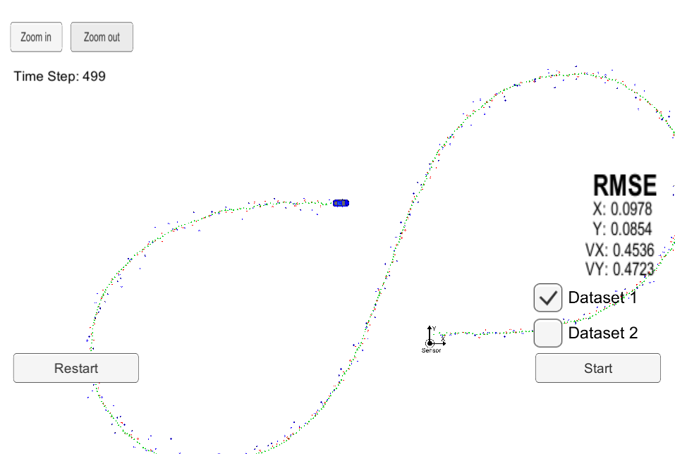
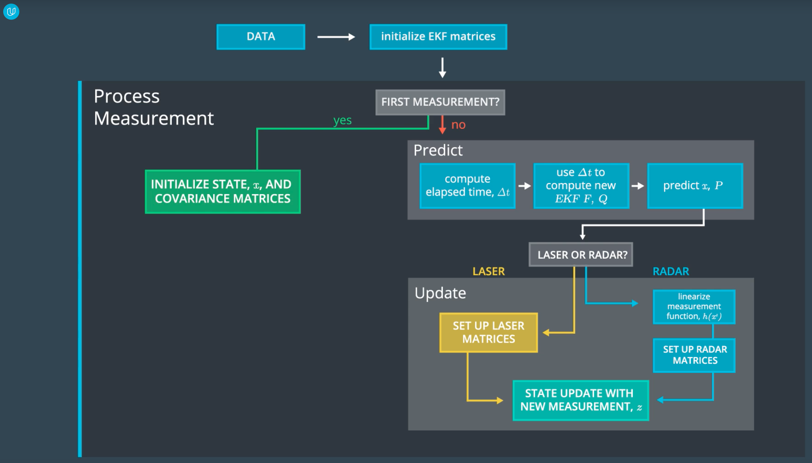

# Project 5 - Extended Kalman Filter

This project from Udacity‘s Self-Driving Car Engineer Nanodegree program introduces sensor fusion and state estimation prediction which are essential for self-driving cars. The project covers the implementation of an extended kalman filter to fuse lidar and radar measurements for state estimation of a bicycle.

---

## 1 - Project Overview

### Goals:

* Build a Kalman filter that can handle lidar and radar input
* Predict the state of a bicycle (position and velocity)
* Test the extended kalman filter in a simulator brovided by Udacity
* The root-mean-square error must be below `[px,py,vx,vy] = [0.11,0.11,0.52,0.52]`

### Structure

The project is divided into different files. The simlator can be found [here](https://github.com/udacity/self-driving-car-sim/releases/).

* `src/kalman_filter.cpp`: the (extended) Kalman filter
* `src/tools.cpp`: code needed to calculate the RSME and the Jacobian matrix
* `src/FusionEKF.cpp`: code for processing measurments and predicting the state of the bicycle

---

## 2 - Rubic Points

Here I will consider the [rubric points](https://review.udacity.com/#!/rubrics/748/view) individually and describe how I addressed each point in my implementation.  


### 2.1 - Compiling

**1.)** **Your code should compile.**

I have not changed the given CMakeLists.txt and the code is compiling without errors with `cmake` and `make`. 


### 2.2 - Accuracy

**1.) px, py, vx, vy output coordinates must have an RMSE <= [.11, .11, 0.52, 0.52] when using the file: "obj_pose-laser-radar-synthetic-input.txt" which is the same data file the simulator uses for Dataset 1.**

I implemented the algorithm and tried to fix all errors and bugs. This is the result:



The final root-mean-square errors are for position X: 0.0978, position Y: 0.0854, velocity X: 0.4536 and velocity Y: 0.4723.


### 2.3 - Follows the Correct Algorithm

**1.) Your Sensor Fusion algorithm follows the general processing flow as taught in the preceding lessons.**

The general processing flow is displayed in the following diagram from Udacity's lesson:



The Extended Kalman Filter matrices are initialized in `FusionEKF.cpp`. The function `ProcessMeasurement(const MeasurementPackage &measurement_pack)` implements the algorithm. 

**2.) Your Kalman Filter algorithm handles the first measurements appropriately.**

The first measurement is handled in lines 61-87 in `FusionEKF.cpp`. The state vector is initialized with the first measurement. If the first measurment is from a radar, the measurment needs to be converted from polar coordinates (rho, phi, phi_dot) to cartesian coordinates (x,y,v_x,v_y)(line 71): 

`ekf_.x_ << z(0) * cos(z(1)), z(0) * sin(z(1)), 0, 0; ` 

The velocity can not be calculated directly from the radar measurement. 
Besides that the predicted state covariance matrix is initialized in lines 79-82.

**3.) Your Kalman Filter algorithm first predicts then updates.**

The prediction is implemented in `FusionEKF.cpp` in lines 89-120. First, the state transition model (F) and the covariance of the process noise are calculated with `dt` the current timestamp minus the previous timestamp. 
Than the function `ekf_.Predict();` is called to predict the current state. This function is implemented in the `kalman_filter.cpp` file:

```c++
void KalmanFilter::Predict() {
    x_ = F_ * x_;
    P_ = F_ * P_ * F_.transpose() + Q_;
}
```

The Kalman filter formulas can also be found on Wikipedia.

To update the prediction the difference between lidar and radar must be considered, because radar needs an extended Kalman filter due to its nonlinearity. This nonlinearity comes from the conversion between polar and cartesian coordinates. The extended Kalman filter uses a second degree, multidimensional Taylor series expansion. The extended Kalman filter is implemented in lines 73-96 in `kalman_filter.cpp` :

```c++
void KalmanFilter::UpdateEKF(const VectorXd &z) {
    // Calculation of polar version of current state
    VectorXd h_x = CartesianToPolar(x_);

    // measurement pre-fit residual and normalization of phi
    VectorXd y = z - h_x;
      while (y(1) > M_PI) {
        y(1) -= 2*M_PI;
    }
    while (y(1) < -M_PI) {
        y(1) += 2*M_PI;
    }
    
    // prefit residual covariance
    MatrixXd S = H_ * P_ * H_.transpose() + R_;
    // optimal Kalman gain
    MatrixXd K = P_ * H_.transpose() * S.inverse();
    // identity matrix
    MatrixXd I = MatrixXd::Identity(x_.size(), x_.size());

    // update state and state variance
    x_ = x_ + K * y;
    P_ = (I - K*H_) * P_;
```

The matrix `H_` is the Jacobian matrix of the conversion from cartesian to polar coordinates and the calculation is implemented in `tools.cpp`. The y(1) (the angle phi of the polar coordinates) must be normalized between `-pi` and `+pi`. 

To update the state estimation with a lidar measurment, the function `KalmanFilter::Update(const VectorXd &z)` is used: 

```c++
void KalmanFilter::Update(const VectorXd &z) {
    MatrixXd P_Ht = P_ * H_.transpose();
    
    // measurement pre-fit residual
    VectorXd y = z - H_ * x_;
    // prefit residual covariance
    MatrixXd S = H_ * P_Ht + R_;
    // optimal Kalman gain
    MatrixXd K = P_Ht * S.inverse();
    // identity matrix
    MatrixXd I = MatrixXd::Identity(x_.size(), x_.size());
    
    // update state and state variance
    x_ = x_ + K * y;
    P_ = (I - K*H_) * P_;
}
```

These are the basic Kalman filter equations.

**4.) Your Kalman Filter can handle radar and lidar measurements.**

As explained above, the extended Kalman filter implementation handles the radar measurments and the basic Kalman filter implememtation handles the lidar measurments.

